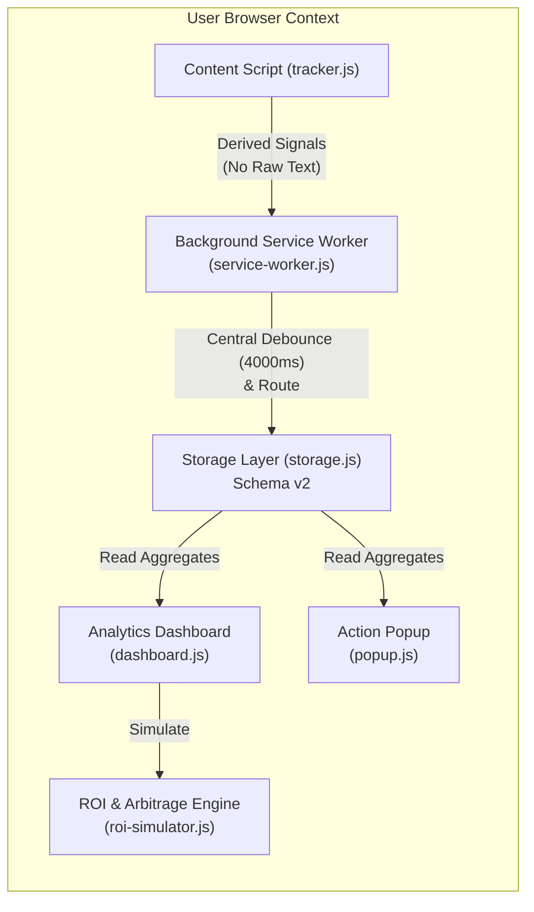

# AIStat — Advanced Analytics & Intelligence Architecture Specification

## 1. Executive Overview & Privacy Guarantees

AIStat is a **100% local-first, zero-cloud telemetry** AI usage tracker and productivity intelligence extension for Google Chrome (Manifest V3).

### Core Privacy Guarantees
* **Zero Remote Telemetry:** Telemetry and analytics operate strictly on-device inside your browser sandbox. No user prompts, conversations, web pages, or model responses are ever transmitted to any remote server or third-party analytics SaaS.
* **No Raw Prompt Content Persistence:** Prompts and conversation text are processed in volatile memory only to derive structural metadata (word counts, complexity scores, category signals). Once classified, raw text is immediately zeroed and discarded.
* **Zero CDN Runtime Dependencies:** All dependencies (such as Lucide icons and rendering modules) are bundled directly within the extension package, strictly adhering to Manifest V3 Content Security Policy (CSP).

---

## 2. Architecture & Data Flow



### Module Responsibilities
* **`shared/topic-categorizer.js`:** Deterministic local heuristic prompt categorization, structural metadata extraction, and 0–100 complexity scoring.
* **`shared/velocity-analyzer.js`:** Prompt velocity (prompts/active hour), inter-prompt turnaround distributions, AI multi-homing context-switching index, workstyle classification (Deep Work vs. Quick Query), and 7×24 weekly interaction heatmaps.
* **`shared/cost-estimator.js`:** Multi-provider pricing catalog, user custom price registry, token computation, model arbitrage savings calculator, and subscription ROI modeling.
* **`dashboard/roi-simulator.js`:** Reactive client-side UI controller for interactive arbitrage and subscription break-even modeling.
* **`shared/storage.js`:** Storage Schema v2 with deterministic migrations, monthly summary rollups, and automated configurable retention policies.
* **`shared/telemetry-exporter.js`:** Exporter suite generating `AIStat-Report-YYYY-MM.md` executive Markdown reports, Prometheus metrics, Schema.org JSON-LD, filtered datasets, and anonymized community benchmarks.

---

## 3. Storage Schema v2 & Migration Strategy

### Schema Versioning
```javascript
export const SCHEMA_VERSION = 2;
```

### Daily Logs Structure (`dailyLogs`)
```json
{
  "2026-08-28": {
    "date": "2026-08-28",
    "messagesCount": 42,
    "platforms": {
      "chatgpt": 15,
      "claude": 12,
      "gemini": 8,
      "deepseek": 7
    },
    "hours": {
      "9": 10,
      "10": 14,
      "14": 12,
      "16": 6
    },
    "topics": {
      "code_debugging": 25,
      "research_analysis": 10,
      "writing_editing": 7
    },
    "models": {
      "gpt-5.6": 15,
      "claude-sonnet-5": 12,
      "gemini-3.7-flash": 8,
      "deepseek-v3": 7
    },
    "complexitySum": 1890,
    "complexityCount": 42
  }
}
```

### Monthly Historical Aggregates (`monthlyAggregates`)
Retains high-level summaries permanently after daily records are cleaned up by retention policies:
```json
{
  "2026-08": {
    "period": "2026-08",
    "messagesCount": 540,
    "platforms": {
      "chatgpt": 280,
      "claude": 160,
      "deepseek": 100
    },
    "topics": {
      "code_debugging": 320,
      "research_analysis": 140,
      "writing_editing": 80
    },
    "activeDays": 24
  }
}
```

### Migration Safety
* **Deterministic & Idempotent:** `StatsStorage.migrateSchema()` inspects the current `schemaVersion`. If version is `< 2`, it safely migrates all existing records, populating defaults for new fields without touching existing counts.
* **Non-Destructive:** Legacy v1 backups can still be restored in merge or overwrite mode; validation upgrades records on the fly.

---

## 4. Feature 1: Local Topic & Semantic Categorization

### Taxonomy Categories
1. **Code / Debugging (`code_debugging`)**: Software engineering, syntax, debugging, algorithms, refactoring, Git, SQL, Docker, APIs.
2. **Writing / Editing (`writing_editing`)**: Prose writing, proofreading, essay drafting, grammar checking, tone adjustment.
3. **Research / Analysis (`research_analysis`)**: Literature summaries, paper reviews, market comparisons, pros and cons.
4. **Mathematics / Logic (`math_logic`)**: Calculus, linear algebra, equations, proofs, probability, boolean logic.
5. **Brainstorming / Creative (`creative_brainstorming`)**: Idea generation, naming, slogans, storytelling, concept design.
6. **Career / Professional (`career_professional`)**: Resumes, cover letters, interview prep, management communication, proposals.
7. **Learning / Education (`learning_education`)**: Explanations (ELI5), study guides, tutoring, concept breakdowns, translation.
8. **General / Other (`general_other`)**: Conversational greetings, general Q&A, formatting requests.

### Classification Engine
* **Regex Pattern Matching:** High-precision regular expressions (+3.0 pts per match).
* **Keyword & Phrase Matching:** Weighted dictionary matching (+1.0 to +1.5 pts).
* **Structural Bonus:** Detects code syntax and math symbols (+4.0 pts).
* **Confidence Scoring:** Computed via victory margin over runner-up category:
  $$\text{Confidence} = \min\left(0.99, \max\left(0.20, \frac{\text{TopScore}}{\text{TotalScore}} \times 0.6 + \frac{\text{Margin}}{\text{TopScore}} \times 0.4\right)\right)$$

### Heuristic Complexity Score (0–100)
A documented composite metric estimating prompt structural depth:
$$\text{Complexity} = \min\left(100, S_{\text{length}} + S_{\text{directives}} + S_{\text{structure}} + S_{\text{code}} + S_{\text{math}} + S_{\text{questions}}\right)$$
* $S_{\text{length}}$: Up to 30 pts (normalized at 200 words).
* $S_{\text{directives}}$: Up to 25 pts (5 pts per instruction/constraint, max 5).
* $S_{\text{structure}}$: Up to 15 pts (paragraphs and list items).
* $S_{\text{code}}$: 15 pts (code blocks or syntax presence).
* $S_{\text{math}}$: 15 pts (mathematical expressions or symbols).
* $S_{\text{questions}}$: Up to 5 pts (interrogatives and question marks).

---

## 5. Feature 2: Productivity & Velocity Analytics

### Prompt Velocity
Measures prompt output rate per active hour:
$$\text{Prompt Velocity} = \frac{\text{Total Prompts}}{\text{Active Hours}}$$
*An active hour is defined as any distinct 60-minute window with $\ge 1$ prompt.*

### Inter-Prompt Turnaround Time
Calculates intervals between successive prompts ($\Delta_i = t_i - t_{i-1}$):
* Tracks **Mean**, **Median ($P_{50}$)**, **$P_{25}$**, **$P_{75}$**, **$P_{90}$**, **$P_{95}$**, **Min**, and **Max**.
* Safely filters out clock reversals and excludes idle gaps $> 30\text{ minutes}$ (session boundaries).

### Context Switching / AI Multi-Homing Index
Measures how often a user switches models or platforms during active workflows:
$$\text{Context Switch Rate} = \frac{\text{Platform Switches}}{\text{Eligible Transitions within 30 min}}$$
$$\text{Multi-Homing Score} = \min\left(1.0, \text{ContextSwitchRate} \times 0.6 + \frac{\text{DistinctPlatforms} - 1}{3} \times 0.4\right)$$

### Workstyle Classification
* **Deep Work:** Session duration $\ge 10\text{ min}$ with $\ge 5\text{ prompts}$ in focused flow.
* **Quick Query:** Short session $\le 3\text{ min}$ with $\le 2\text{ prompts}$.
* **Iterative Coding / Multi-tasking:** Intermediate working patterns.
* Ratios $\text{DeepWorkRatio}$ and $\text{QuickQueryRatio}$ handle zero denominators safely.

### Weekly 7×24 Interaction Intensity Heatmap
Generates a $7 \times 24$ matrix (Monday–Sunday, Hours 00:00–23:00) with normalized cell intensity for visualizing productivity rhythms.

---

## 6. Feature 3: Model Cost, Arbitrage & ROI Simulator

### Normalized Pricing Model Catalog
Supports standard providers and custom user-registered overrides:
* **Google:** Gemini 3.7 Flash ($0.75 / $3.75), Gemini 3.1 Pro ($2.00 / $12.00).
* **OpenAI:** GPT-5.6 ($2.50 / $10.00), GPT-5.6 Mini ($0.25 / $1.20), o3 ($2.00 / $8.00), o3-mini ($1.10 / $4.40).
* **Anthropic:** Claude Sonnet 5 ($3.00 / $15.00), Claude Fable 5 ($1.50 / $7.50), Claude 3.7 Sonnet ($3.00 / $15.00).
* **DeepSeek:** DeepSeek-V3 ($0.27 / $1.10), DeepSeek-R1 ($0.55 / $2.19), DeepSeek Coder V2 ($0.14 / $0.28).
* **Perplexity:** Sonar Pro ($3.00 / $15.00), Sonar 2 ($1.00 / $3.00), Sonar Deep Research ($5.00 / $25.00).

### Arbitrage Savings Calculator
Compares workload cost across models:
$$\text{Baseline Cost} = \frac{\text{Input Tokens}}{1,000,000} \times P_{\text{in}}^{\text{base}} + \frac{\text{Output Tokens}}{1,000,000} \times P_{\text{out}}^{\text{base}}$$
$$\text{Alternative Cost} = \frac{\text{Input Tokens}}{1,000,000} \times P_{\text{in}}^{\text{alt}} + \frac{\text{Output Tokens}}{1,000,000} \times P_{\text{out}}^{\text{alt}}$$
$$\text{Savings} = \text{Baseline Cost} - \text{Alternative Cost}$$
$$\text{Savings \%} = \frac{\text{Savings}}{\text{Baseline Cost}} \times 100$$

### Subscription ROI Modeling
Compares subscription price against equivalent raw API value:
$$\text{Break-Even Prompts} = \left\lceil \frac{\text{Subscription Cost}}{\text{Avg Cost Per Message}} \right\rceil$$
$$\text{ROI \%} = \frac{\text{API Value}}{\text{Subscription Cost}} \times 100$$

---

## 7. Feature 4: Advanced Dashboard

* **Topic Distribution Chart:** Visualizes percentage share of prompt categories.
* **Weekly 7×24 Heatmap:** Interactive matrix displaying hourly usage by weekday with hover tooltips.
* **Productivity Intelligence Panel:** Real-time gauges for Deep Work ratio, Multi-Homing index, and peak interaction windows.
* **Model Arbitrage & ROI Simulator Tab:** Interactive sliders for prompt volume, model comparison dropdowns, and live break-even calculations.
* **Composable Dimension Filters:** Filter by Date Range $\times$ Platform $\times$ Topic $\times$ Workstyle without mutating underlying telemetry.

---

## 8. Feature 5: Retention & Export Suite

### Automated Retention
* Options: **30 Days**, **90 Days**, **365 Days**, or **Disabled**.
* Automatically purges detailed daily logs older than the cutoff while rolling up monthly summaries into `monthlyAggregates`.

### Privacy-Safe Markdown Report Export (`AIStat-Report-YYYY-MM.md`)
Includes Executive Summary, Platform Rankings, Topic Breakdown, Model Arbitrage, 30-Day Cost & ROI Modeling, and Methodology Notes.

### Anonymous Community Benchmark Export (`AIStat-Anonymous-Benchmark.json`)
Strips all timestamps, URLs, identifiers, and exact dates, outputting only normalized percentage distributions for community benchmarking.

---

## 9. Test Verification & Performance Benchmarks

* **Total Test Suites:** 20 test files
* **Total Passing Tests:** 181 unit & integration tests (100% passing)
* **Code Coverage:** $> 90\%$ across all core analytics modules
* **365+ Day Stress Test:** Aggregates 370 dense historical days in $< 250\text{ ms}$

---

## 10. Changelog

* `feat(analytics)`: Added deterministic topic categorizer with metadata extraction and complexity scoring.
* `feat(analytics)`: Added velocity analyzer with turnaround percentiles, multi-homing index, and 7×24 heatmap.
* `feat(cost)`: Implemented normalized pricing schema, custom model registry, arbitrage calculator, and ROI simulator.
* `feat(storage)`: Upgraded to Schema v2 with monthly rollups and automated retention policies.
* `feat(export)`: Added `AIStat-Report-YYYY-MM.md` Markdown report and Anonymous Community Benchmark exporter.
* `feat(dashboard)`: Built composable multi-dimensional filters, weekly heatmap, and interactive ROI simulator.
* `test(analytics)`: Added 45+ new unit and stress tests achieving 100% pass rate.
