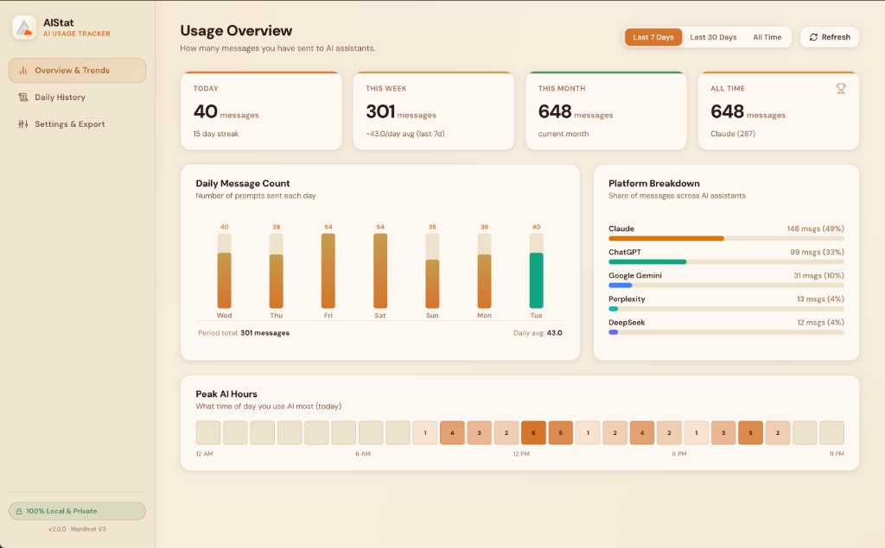
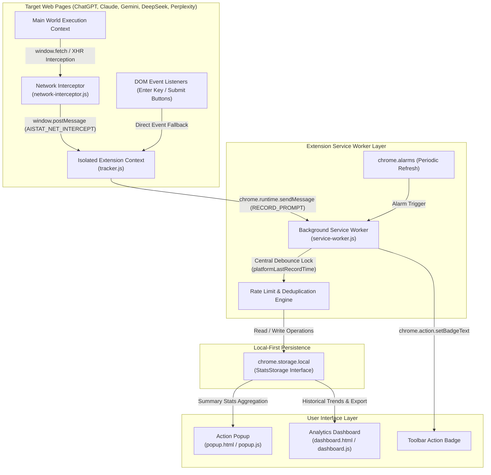
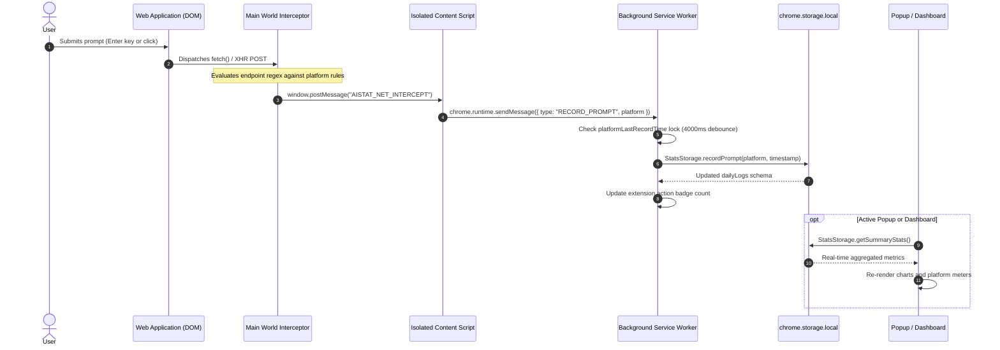
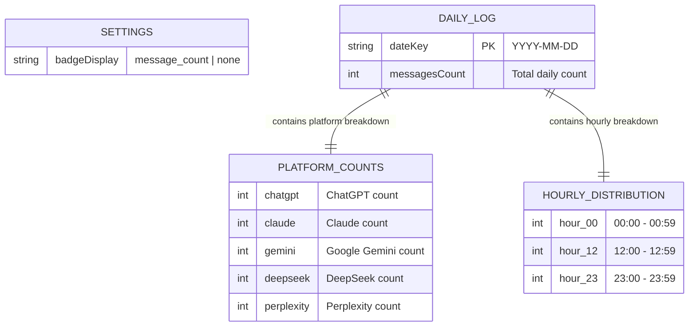
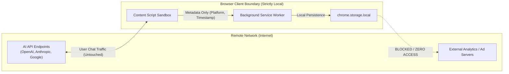

# AIStat

[](file:///Users/sreeramlagisetty/Desktop/ai_stat/manifest.json)
[](file:///Users/sreeramlagisetty/Desktop/ai_stat/LICENSE)
[](https://github.com/Sreeram5678/ai_stat/actions)
[](#supported-ai-platforms)
[](#privacy--security-boundary)
[](https://github.com/Sreeram5678/ai_stat/releases/tag/v2.0.0)

**AIStat** is a lightweight, local-first Chromium extension engineered to measure, analyze, and aggregate user interactions across major Artificial Intelligence conversation platforms. Built on Chrome Extensions Manifest V3, AIStat provides telemetry on message volume, platform distribution, hourly activity density, and historical usage trends with a strict zero-cloud privacy guarantee.

---

## Dashboard Preview



---

## Architecture Overview

AIStat operates using a multi-tiered execution model that strictly separates content inspection, event arbitration, persistent storage, and analytical presentation.



---

## Core Features

- **Dual-Engine Submission Detection**: Combines network API interception in the main DOM execution world with targeted DOM event listeners in the isolated world to ensure 100% prompt capture accuracy across single-page applications.
- **Cross-Frame Event Deduplication**: Employs timestamp hashing and per-platform lock intervals to prevent duplicate counting during multi-frame page loads and rapid-fire network retries.
- **24-Hour Activity Density Analysis**: Aggregates interaction timestamps into hourly distribution histograms to identify peak productivity windows.
- **Multi-Window Rate Limiting Support**: Computes rolling hourly and daily message budgets to assist users managing tiered API quotas and subscription limits.
- **Granular Data Portability**: Complete export pipeline supporting structured JSON backups and flattened RFC-4180 compliant CSV exports.
- **100% On-Device Isolation**: Zero remote servers, zero external analytics telemetry, zero third-party script tags.

---

## Event Processing Sequence

The sequence diagram below illustrates the complete lifecycle of a prompt capture event, from DOM trigger to local persistence and UI synchronization.



---

## Storage & Data Model

All telemetry records are structured inside `chrome.storage.local` under a standardized hierarchical schema managed through the `StatsStorage` abstraction layer.



### Storage Schema Definition

```json
{
  "settings": {
    "badgeDisplay": "message_count"
  },
  "dailyLogs": {
    "2026-08-18": {
      "date": "2026-08-18",
      "messagesCount": 42,
      "platforms": {
        "chatgpt": 18,
        "claude": 14,
        "gemini": 6,
        "deepseek": 2,
        "perplexity": 2
      },
      "hours": {
        "9": 5,
        "10": 12,
        "14": 15,
        "16": 10
      }
    }
  }
}
```

---

## Privacy & Security Boundary



AIStat enforces an immutable security posture:
- **No Payload Extraction**: Prompt content, conversation transcripts, source code, and API tokens are never read, stored, or processed. Only platform identity and submission timestamps are recorded.
- **No Remote Egress**: The extension does not declare `webRequest` or open external network sockets.
- **Strict Host Scoping**: Host permissions are limited exclusively to official AI conversational endpoints.

---

## Supported AI Platforms

| Platform | Domain Filter | Primary Detection Vector | Fallback Vector |
| :--- | :--- | :--- | :--- |
| **ChatGPT** | `chatgpt.com`, `chat.openai.com` | `POST /backend-api/conversation` | DOM Textarea keydown listener |
| **Claude** | `claude.ai` | `POST /api/organizations/.../chat_messages` | DOM Contenteditable submission button |
| **Google Gemini** | `gemini.google.com` | `POST .../_/BardChatUi/data/assistant.lamda.BardFrontendService/StreamGenerate` | Enter key on rich text editor |
| **DeepSeek** | `chat.deepseek.com` | `POST /api/v0/chat/completion` | DOM Textarea input handler |
| **Perplexity** | `perplexity.ai`, `www.perplexity.ai` | `POST /rest/queries`, `POST /rest/ask` | Search bar query interceptor |

---

## Project Structure

```
ai_stat/
├── .github/
│   ├── ISSUE_TEMPLATE/
│   │   ├── bug_report.md
│   │   └── feature_request.md
│   ├── workflows/
│   │   └── validate.yml
│   └── pull_request_template.md
├── background/
│   └── service-worker.js       # Manifest V3 background worker and badge controller
├── content-scripts/
│   ├── network-interceptor.js  # Main-world fetch/XHR hook script
│   └── tracker.js              # Isolated-world DOM and event bridge script
├── dashboard/
│   ├── dashboard.html          # Full-screen analytics interface
│   ├── dashboard.css           # Modern design system and CSS grid layout
│   └── dashboard.js           # Analytics controller, SVG chart generators, exporters
├── popup/
│   ├── popup.html              # Action popup user interface
│   ├── popup.css               # Compact popup styling
│   └── popup.js                # Popup live data binding controller
├── shared/
│   ├── constants.js            # Platform definitions, color taxonomy, domain rules
│   ├── storage.js              # Chrome storage abstraction layer and calculations
│   └── lucide.min.js           # Lightweight vector iconography engine
├── icons/                      # Extension asset icons (16px, 32px, 48px, 128px, 1024px)
├── .gitignore                  # Git exclusion rules
├── CHROMEWEBSTORE.md           # Chrome Web Store technical specification
├── CONTRIBUTING.md             # Developer contribution guidelines
├── LICENSE                     # MIT Open Source License
├── manifest.json               # Manifest V3 extension configuration
├── README.md                   # Technical documentation and architecture guide
└── SECURITY.md                 # Security model and vulnerability disclosure policy
```

---

## Installation & Development Setup

### Requirements
- Google Chrome version 114+ or any Chromium derivative (Brave, Microsoft Edge, Opera, Arc).
- Node.js 18+ (optional, for running local CI validation scripts).

### Installation Steps
1. Clone the repository to your local workstation:
   ```bash
   git clone https://github.com/Sreeram5678/ai_stat.git
   cd ai_stat
   ```

2. Open Google Chrome and navigate to the Extensions management console:
   ```
   chrome://extensions
   ```

3. Enable **Developer mode** via the switch located in the upper-right corner.

4. Click the **Load unpacked** button in the upper-left toolbar.

5. Select the `ai_stat` project directory.

6. The extension is now active. Open any supported AI platform (e.g., ChatGPT or Claude) and submit a prompt to verify counter increments.

---

## Data Export & Portability

AIStat provides two native export formats directly from the Analytics Dashboard:

1. **Structured JSON**: Complete dump of all raw day-by-day telemetry, hourly distributions, and user preferences for backup and migration.
2. **RFC-4180 CSV**: Normalized tabular export suitable for immediate ingestion into business intelligence tools, pandas, R, or spreadsheet applications.

### Sample CSV Output Structure

```csv
Date,Total Messages,ChatGPT,Claude,Gemini,DeepSeek,Perplexity
2026-08-14,35,12,15,5,2,1
2026-08-15,48,20,18,6,3,1
2026-08-16,29,10,12,4,2,1
2026-08-17,54,22,20,8,3,1
2026-08-18,42,18,14,6,2,2
```

---

## Contributing

Contributions to AIStat are welcome. Whether you want to add support for new AI platforms, build visual themes, or enhance data exporters:

- **Quick Start Guide**: Read [How to Add a New AI Platform](file:///Users/sreeramlagisetty/Desktop/ai_stat/CONTRIBUTING.md#how-to-add-support-for-a-new-ai-platform-step-by-step-tutorial) for a 3-step walkthrough.
- **Contribution Workflow**: Check [CONTRIBUTING.md](file:///Users/sreeramlagisetty/Desktop/ai_stat/CONTRIBUTING.md) for full branch naming, code standards, and verification guidelines.
- **Good First Issues**: Explore open beginner-friendly issues on the [Issue Tracker](https://github.com/Sreeram5678/ai_stat/issues?q=is%3Aissue+is%3Aopen+label%3A%22good+first+issue%22).

---

## License

This project is licensed under the terms of the [MIT License](file:///Users/sreeramlagisetty/Desktop/ai_stat/LICENSE).
